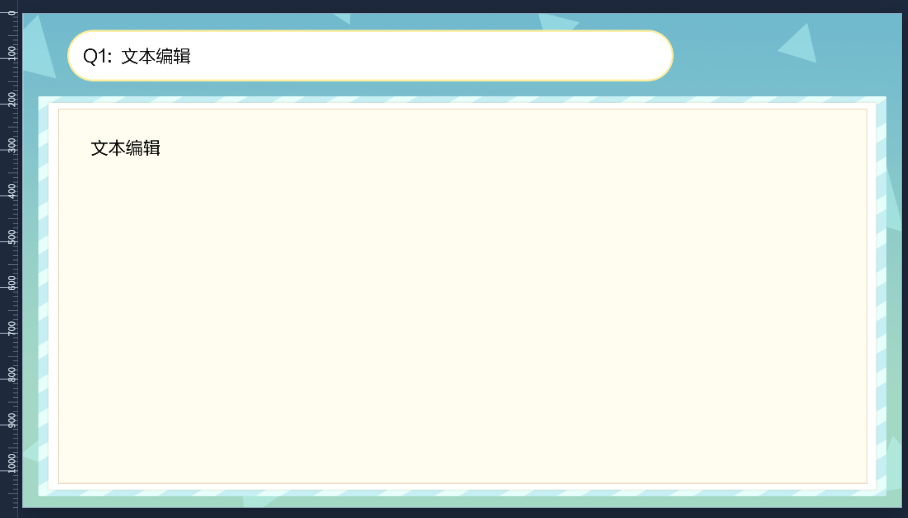
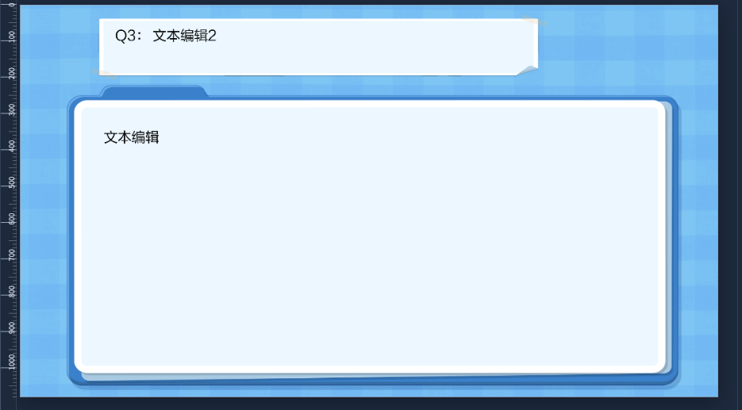
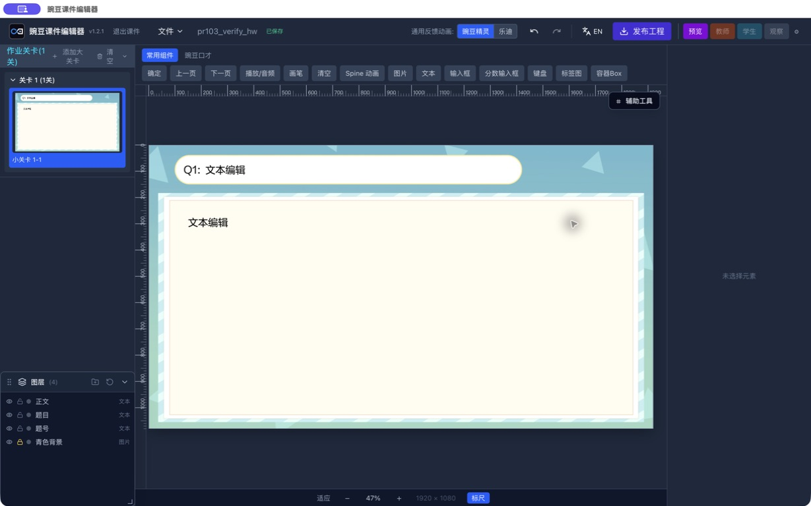
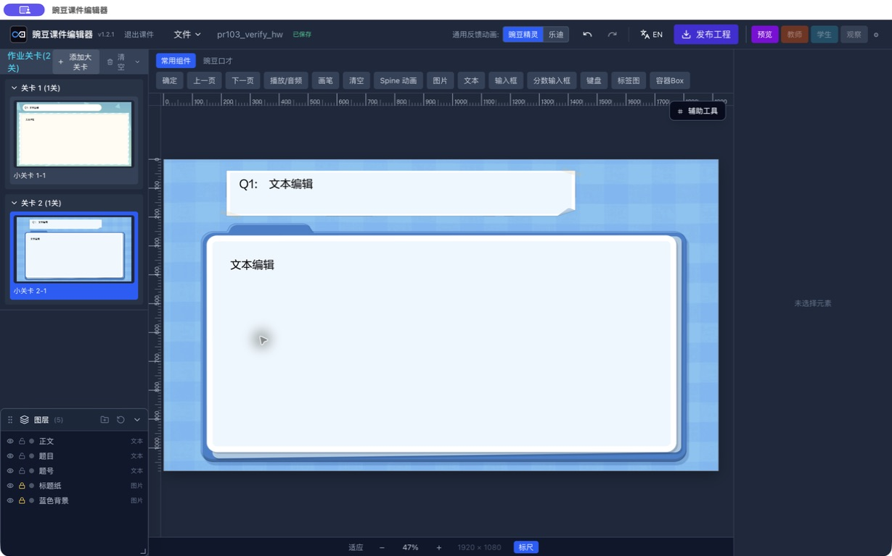

# 第三阶段：组合预设模板

> 更新日期：2026-07-26
> 用途：记录组合模板建设方向和后续 issue 拆解依据。

## 背景问题

老师制作课件时，很多页面结构和交互组合会重复出现。如果每次都从空白页面开始搭建组件、插图、写文本、配按钮，会消耗大量时间，也容易出现结构不统一的问题。

当前项目已经有自定义模板能力，但后续还需要把高频业务场景整理成更清晰、更好用的组合预设模板。

## 目标效果

老师可以从模板开始制作，而不是从空白页面开始制作。

理想流程：

1. 老师选择一个常用模板。
2. 编辑器自动添加对应页面结构和组件组合。
3. 老师替换图片、编辑文本、调整按钮。
4. 老师根据需要增删少量元素。
5. 快速产出可用课件内容。

模板的重点不是“锁死内容”，而是提供一个好改、好理解、能快速开始的结构。

## 当前项目现状

当前项目已有：

- 预设模板入口。
- 自定义模板目录。
- 保存当前小关卡为模板。
- 从模板创建关卡或小关卡。
- 模板资源复制和去重机制。

当前缺口：

- 预设模板数量很少。
- 模板还没有按真实题型和老师工作流系统整理。
- 模板缺少适用场景说明。
- 模板还没有和 S1-S9 组件分类联动。
- 缺少首批模板建设优先级。

## 方案方向

第三阶段在第一阶段和第二阶段基础上进行。

推荐方向：

- 优先整理真实高频场景。
- 每个模板都要能被老师直接改，不做只能展示不能编辑的模板。
- 模板应该包含结构、组件、默认布局和必要交互。
- 模板可以按年级、题型、用途分组。
- 先做少量高质量模板，再根据反馈扩展。

## 已确认的模板规则

Issue #102 起，内置预设模板遵循以下规则：

- 每个模板使用稳定且唯一的模板 ID，模板适用的课件类型单独配置。
- 同一份母版可以同时属于多个课件类型；只有内容或用途需要分化时才新增模板 ID。
- 模板母版只读。老师点击模板卡片后直接套用，编辑器深拷贝页面、元素和引用关系并生成新的实例 ID。
- 已套用的关卡彼此独立；修改、删除或保存其中一份，不影响母版、其他实例和下一次套用。
- 背景与装饰元素默认锁定，题号、标题和正文默认可编辑；老师仍可在图层面板主动解锁背景。
- 模板卡片按当前课件类型筛选，但不能改变正常课、预习、复习课和既有模板的原有入口。
- 内置模板资源必须进入受 Git 管理的 `public/builtin/runtime/game/`，通过 `builtinAssets.ts` 注册，并同步更新 `game.zip`。

“只读”指老师不能从实例反向修改母版，不代表实例不可编辑，也不建立母版与实例之间的自动更新关系。

首批模板可以从这些方向筛选：

- 单题讲解模板。
- 练习题模板。
- 带二级弹窗的讲解模板。
- 图文混排模板。
- 拖拽交互模板。
- 选择题交互模板。

## 不做什么

第三阶段暂不处理：

- 一次性覆盖所有题型。
- 做复杂模板市场。
- 把模板变成不可编辑的固定课件。
- 在没有第一阶段结构管理结论前，大规模制作复杂弹窗模板。
- 在没有第二阶段组件清单前，大规模绑定 S1-S9 资源。

## 首批实施 Issue

阶段三最初建立了两个前置 Issue：

1. [#26 梳理老师最高频使用的 5 个课件结构](https://github.com/RexYoung000/editor/issues/26)。
2. [#27 定义组合预设模板的分类、命名、适用阶段与验收规则](https://github.com/RexYoung000/editor/issues/27)。

在 Rex 提供真实模板效果并逐项确认后，[#102 新增作业与专题测评题目版式模板](https://github.com/RexYoung000/editor/issues/102) 作为首个实施 Issue。它同时交付共用的课件类型归属机制和两套结构一致、无题型逻辑的题目版式，避免为同一用户流程拆出重复基础设施。

| 模板 ID | 展示名称 | 适用课件类型 | 默认结构 |
| --- | --- | --- | --- |
| `question-layout-aqua-01` | 青色题目版式 | 线上作业、专题测评 | 锁定背景 + 独立题号、标题、正文文本 |
| `question-layout-blue-01` | 蓝色题目版式 | 线上作业 | 锁定背景和标题纸 + 独立题号、标题、正文文本 |

首批模板只提供版式，不预装选择、填空、拖拽等题型组件，不配置判定事件。以后需要把相同视觉扩展为具体题型或让作业与专题测评分化时，应新增模板 ID 和对应 Issue，不修改现有模板的业务含义。

### 视觉基线

图 1 是线上作业与专题测评共用的青色题目版式：

图 2 是仅用于线上作业的蓝色题目版式：

### Electron 实现验收

青色题目版式在真实 Electron 画布中的效果：

蓝色题目版式在真实 Electron 画布中的效果：

Issue #102 已在真实线上作业和专题测评课件中完成模板筛选、套用、保存重开、预览和本地工程导出验证。线上作业的两套模板均保持背景、装饰与文字布局，专题测评只提供青色模板；导出工程包含对应 scene、config 资源登记和实际图片文件。测试目录不是 SVN 工作副本，因此验收只验证本地工程导出，不执行 SVN 提交或正式发布。

每个后续模板 Issue 仍须说明适用场景、默认结构、可编辑边界、资源来源和真实预览验收方式。单题讲解、练习题、二级弹窗、图文混排、拖拽和选择题继续作为候选方向，不因首批版式落地而自动进入实施范围。

## 验收标准

第三阶段完成的标准：

- 老师可以从模板快速创建一个可编辑的小关卡。
- 模板添加后不需要大量清理无关元素。
- 模板结构和元素命名清晰。
- 老师能在模板基础上替换图片和文字。
- 老师能增删按钮并继续保持结构可理解。
- 首批模板能覆盖最常见的制作场景。
